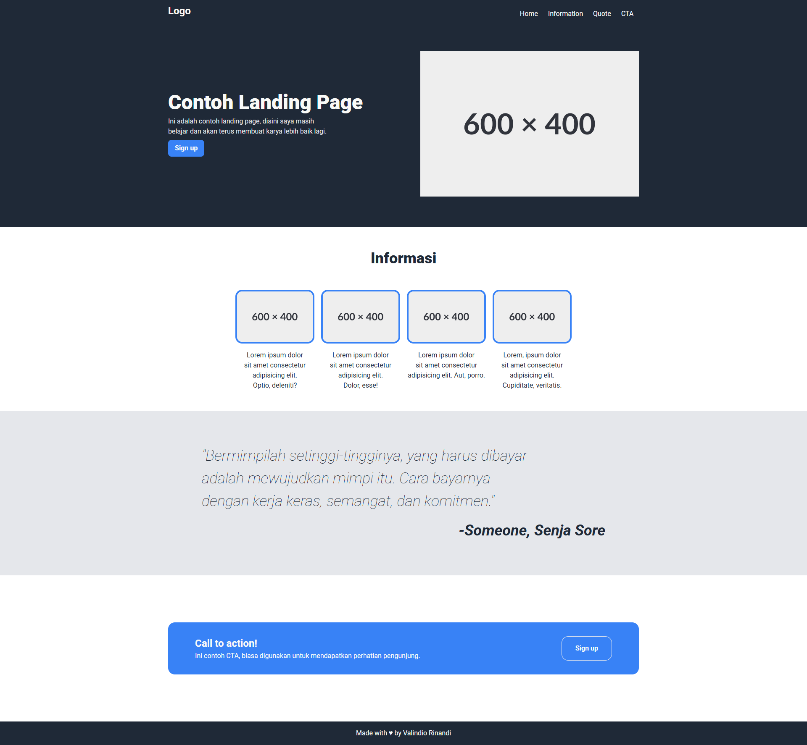

# Project Landing Page

Membuat landing page sederahana hanya menggunakan HTML dan CSS

Disini saya belajar :

- Membuat layout
- Menggunakan Flexbox
- Menggunakan Grid
- Menggunakan variabel dalam CSS

Preview : [Website Landing Page](https://valindio.github.io/project-landing-page/)
